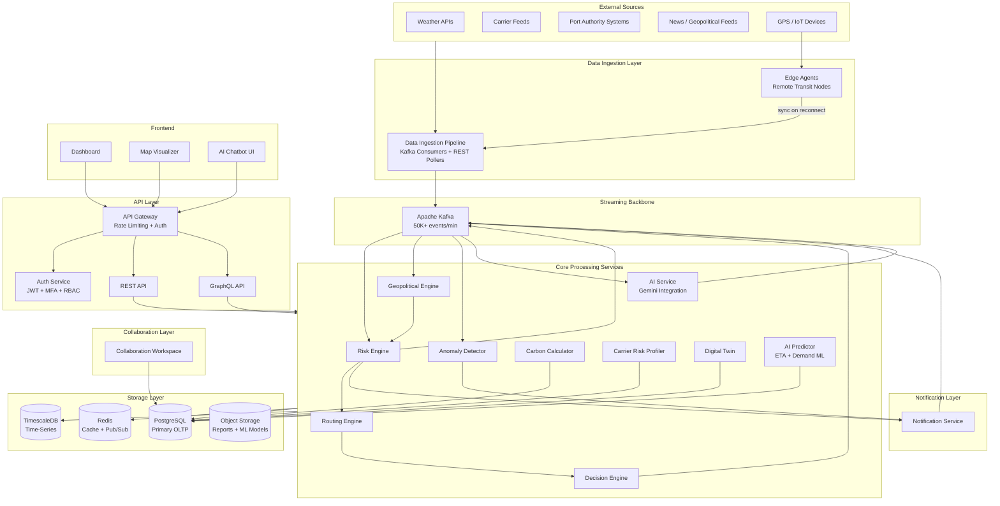

# Design Document: Smart Supply Chain Optimization

## Overview

Smart Supply Chain Optimization is an AI-powered, real-time logistics intelligence platform that monitors millions of concurrent shipments across global transportation networks. The system proactively detects transit disruptions — weather events, carrier delays, port congestion, geopolitical instability, and active conflict zones — before they compromise delivery timelines.

The platform provides:
- Unified, multi-dimensional risk scoring per shipment
- Dynamic rerouting recommendations across air, sea, rail, and road
- Autonomous decision execution with full audit trails
- Digital twin simulation for scenario planning
- Carbon footprint optimization
- Carrier risk profiling
- Anomaly detection for fraud and theft
- Edge computing for offline environments
- Gemini-powered explainable AI, chatbot, and narrative reporting
- Multi-tenant REST and GraphQL API ecosystem

### Architecture Principles

- **Event-driven**: All state changes propagate through Kafka topics; no polling between internal services
- **Multi-tenant isolation**: Every data access is scoped by `tenant_id` enforced at the database and API layers
- **Eventual consistency with bounded latency**: Risk scores converge within 2 minutes of any triggering event
- **Graceful degradation**: Every external dependency (Gemini, weather APIs, carrier feeds) has a fallback path
- **Horizontal scalability**: All stateless services scale independently; stateful services use partitioned storage
- **Auditability by default**: Every mutation, decision, and AI interaction is logged with actor identity and timestamp

---

## Architecture

### System Architecture Diagram



### Technology Stack

| Layer | Technology | Rationale |
|---|---|---|
| API Framework | FastAPI (Python) | Async-native, OpenAPI auto-generation, strong typing via Pydantic |
| Streaming | Apache Kafka | Proven at 50K+ events/min, durable log, consumer group fan-out |
| Primary DB | PostgreSQL 16 | ACID transactions, row-level security for tenant isolation, JSONB for flexible schemas |
| Time-Series DB | TimescaleDB (PostgreSQL extension) | Risk score history, ETA history, event timelines — native time-series queries |
| Cache / Pub-Sub | Redis 7 | Sub-millisecond cache for active shipment state, pub/sub for real-time dashboard updates |
| Object Storage | AWS S3 / compatible | ML model artifacts, report exports, audit log archives |
| ML Runtime | Python + scikit-learn / PyTorch | ETA prediction, demand forecasting, NLP signal extraction |
| AI / LLM | Google Gemini API | Explainable AI, chatbot, narrative report generation, anomaly explanation |
| Maps | Mapbox GL JS | Vector tile rendering, custom overlays, offline tile support for edge |
| Edge Runtime | Python (lightweight) | Runs on constrained hardware at remote transit nodes |
| Auth | JWT (RS256) + TOTP MFA | Stateless, verifiable, configurable expiry |
| Container Orchestration | Kubernetes | Horizontal pod autoscaling per service |
| Service Mesh | Istio | mTLS between services, circuit breakers, observability |

---

## Components and Interfaces

### 1. Data Ingestion Pipeline

Responsible for collecting, validating, and normalizing data from all external sources before publishing to Kafka.

**Sub-components:**
- `RestPoller`: Scheduled polling of carrier REST APIs and weather endpoints (configurable interval per source)
- `WebhookReceiver`: FastAPI endpoints that accept push events from port authorities and carrier systems
- `KafkaConsumer`: Subscribes to external Kafka/SQS topics (carrier delay feeds, news aggregators)
- `SchemaValidator`: Validates every incoming record against the canonical `InternalEvent` schema using Pydantic; rejects and logs invalid records
- `Normalizer`: Transforms source-specific payloads into `InternalEvent` format
- `BacklogProcessor`: On source reconnection, replays buffered events in chronological order

**Kafka Topics Published:**
- `raw.weather.events`
- `raw.carrier.updates`
- `raw.port.events`
- `raw.news.events`
- `raw.shipment.positions`

**Throughput target:** ≥ 50,000 events/minute (Req 6.5)

**Error handling:** Invalid records are written to `ingestion.dlq` (dead-letter queue) with structured error metadata. The pipeline continues processing subsequent records without interruption (Req 1.5).

---

### 2. Risk Engine

The central computation service that maintains unified Risk_Scores for all active shipments.

**Risk Score Formula:**

```
Risk_Score = clamp(
    w_weather * weather_risk +
    w_operational * operational_risk +
    w_war * war_state_risk +
    w_geopolitical * geopolitical_risk,
    0, 100
)
```

Default weights: `w_weather=0.25, w_operational=0.30, w_war=0.25, w_geopolitical=0.20` (tenant-configurable)

**Sub-components:**
- `WeatherRiskEvaluator`: Scores weather impact on route segments
- `OperationalRiskEvaluator`: Incorporates carrier on-time rate, node dwell time vs 90th-percentile baseline
- `WarStateEvaluator`: Applies War_State classification to route segments; adds minimum 30 points for High_Risk/Restricted regions
- `GeopoliticalRiskEvaluator`: Applies Geopolitical_Risk_Index from the Geopolitical Engine
- `RiskAggregator`: Combines dimension scores into unified Risk_Score
- `EscalationDetector`: Detects 20+ point increases within 1-hour windows and triggers Risk_Escalation alerts
- `ScheduledRecalculator`: Ensures all active shipments are recalculated at least every 15 minutes

**Kafka Topics Consumed:** `raw.weather.events`, `raw.carrier.updates`, `raw.port.events`, `geopolitical.risk.updates`, `war.state.updates`

**Kafka Topics Published:** `risk.score.updates`, `risk.escalations`, `disruption.detected`

**SLA:** Risk_Score updated within 2 minutes of any triggering event (Req 2.3, 23.2)

---

### 3. Geopolitical Engine

Processes news and intelligence feeds to maintain Geopolitical_Risk_Index and War_State classifications per region.

**Sub-components:**
- `NewsIngestionConsumer`: Consumes from `raw.news.events`; supports 5+ languages via translation pre-processing
- `NLPSignalExtractor`: Python ML model (fine-tuned transformer) that extracts geopolitical signals: sanctions, political instability, trade restrictions
- `GeopoliticalIndexUpdater`: Maintains per-region Geopolitical_Risk_Index (0–100); detects 20+ point increases in 24h windows
- `WarStateClassifier`: Classifies regions as Safe / Caution / High_Risk / Restricted based on conflict data sources; monitors airspace closures and naval blockades
- `RegionRegistry`: Maintains geographic region definitions and their current risk state

**Kafka Topics Published:** `geopolitical.risk.updates`, `war.state.updates`

**Update SLA:** Geopolitical_Risk_Index updated within 5 minutes of relevant event (Req 22.3); War_State re-evaluation of affected shipments within 5 minutes (Req 21.2)

---

### 4. Routing Engine

Generates and ranks Reroute_Recommendations for disrupted shipments.

**Sub-components:**
- `RouteGraph`: In-memory weighted directed graph of all transit nodes and transport links, updated from Kafka events
- `MultiModalPlanner`: Evaluates hybrid routes combining air, sea, rail, and road segments
- `RouteScorer`: Scores candidate routes on cost, transit time, risk score, and CO₂ delta
- `EcoRankingAdjuster`: Re-ranks routes for tenants with eco-friendly preference enabled (Req 13.3)
- `DemandPriorityWeighter`: Applies demand-zone priority weighting to shipment routing (Req 15.3)
- `RestrictionFilter`: Excludes routes through War_State Restricted regions and disrupted infrastructure (Req 4.2, 16.4, 21.4)
- `RecommendationPublisher`: Publishes generated recommendations to `routing.recommendations`

**Generation SLA:** Recommendations generated within 5 minutes of qualifying Risk_Score threshold (Req 4.4)

**Kafka Topics Consumed:** `risk.score.updates`, `war.state.updates`, `disruption.detected`

**Kafka Topics Published:** `routing.recommendations`

---

### 5. Decision Engine

Executes autonomous rerouting decisions and manages manual overrides.

**Sub-components:**
- `AutonomousExecutor`: When autonomous mode is enabled by Admin, automatically applies highest-ranked recommendation for shipments with Risk_Score > 70
- `OverrideHandler`: Processes Manager/Admin manual overrides; reverts shipment to specified route within 2 minutes
- `AuditLogger`: Logs every autonomous decision and override with triggering score, recommendation ID, timestamp, and actor identity
- `DecisionAuditAPI`: Exposes audit trail to Admin and Manager roles with configurable lookback period

**Kafka Topics Consumed:** `routing.recommendations`

**Kafka Topics Published:** `shipment.route.updates`, `decision.audit.events`

---

### 6. AI Service (Gemini Integration)

Provides explainable AI, chatbot, automated summaries, and narrative reporting powered by the Gemini API.

**Sub-components:**
- `GeminiClient`: Wrapper around the Gemini API with retry logic, timeout enforcement (5s SLA), and circuit breaker
- `RiskExplainer`: Triggered by significant Risk_Score changes; constructs a structured prompt with contributing factors and calls Gemini to generate natural language explanation (Req 25.2)
- `ChatbotHandler`: Processes natural language queries from stakeholders; maintains conversation context per session; routes to Gemini with relevant shipment/risk context injected (Req 25.3)
- `NewsEventSummarizer`: Triggered by geopolitical news ingestion; generates concise summaries of events and projected supply chain impact (Req 25.4)
- `AnomalyExplainer`: Triggered by Anomaly_Detector events; generates explanation of detected pattern and suggested response actions (Req 25.5)
- `NarrativeReportGenerator`: Generates automated narrative reports summarizing supply chain performance, disruption trends, and risk outlook (Req 25.6)
- `FallbackExplainer`: Rule-based explanation generator activated when Gemini API is unavailable (Req 25.8)
- `AIInteractionLogger`: Logs every AI interaction (query, response, timestamp, stakeholder identity) to `ai_interaction_log` table (Req 25.9)

**Fallback Strategy:** Circuit breaker monitors Gemini API health. On failure, `FallbackExplainer` generates template-based explanations from structured risk data. Degraded-mode events are logged to `system.degraded_mode.events` Kafka topic.

**Kafka Topics Consumed:** `risk.score.updates`, `raw.news.events`, `anomaly.detected`

**Kafka Topics Published:** `ai.explanations`, `ai.summaries`

---

### 7. AI Predictor

Machine learning service for ETA prediction and demand forecasting.

**Sub-components:**
- `ETAPredictor`: Gradient boosting model (LightGBM) trained on historical transit data, carrier performance, route characteristics; achieves MAPE < 10% (Req 10.2)
- `ConfidenceIntervalEstimator`: Generates prediction intervals using quantile regression
- `DemandForecaster`: Time-series model (Prophet / LSTM) generating 7-day demand forecasts per geographic zone (Req 15.1)
- `ModelTrainer`: Scheduled retraining pipeline running every 24 hours using latest historical data (Req 10.3)
- `FeedbackCollector`: Captures actual delivery timestamps as training feedback signals (Req 10.4)

**Model Storage:** Trained model artifacts stored in S3; versioned with MLflow

---

### 8. Notification Service

Delivers alerts to stakeholders via email, SMS, and webhook.

**Sub-components:**
- `AlertClassifier`: Assigns severity (Informational / Warning / Critical) based on Risk_Score and trigger type (Req 24.1, 24.2)
- `DeduplicationFilter`: Suppresses duplicate alerts for the same disruption-shipment-stakeholder combination within 30-minute windows (Req 5.6)
- `QuietPeriodEnforcer`: Suppresses non-critical alerts during configured quiet periods; queues digest (Req 5.5); bypassed for Critical alerts (Req 24.3, 21.5)
- `EmailSender`: Sends via SendGrid / SES with retry (3 attempts, exponential backoff) (Req 5.4)
- `SMSSender`: Sends via Twilio with same retry policy
- `WebhookDispatcher`: HTTP POST to registered webhook URLs with HMAC signature
- `DeliveryAuditLogger`: Records delivery timestamp, channel, and recipient for every alert (Req 5.3)

**Delivery SLA:** Alert delivered within 5 minutes of disruption confirmation (Req 5.1)

**Kafka Topics Consumed:** `disruption.detected`, `risk.escalations`, `war.state.updates`, `anomaly.detected`, `decision.audit.events`

---

### 9. Anomaly Detector

Monitors shipments for route deviations, fraud, and theft patterns.

**Sub-components:**
- `RouteDeviationMonitor`: Compares real-time GPS positions against planned route; triggers alert when deviation exceeds configurable threshold (default 50km) (Req 18.1)
- `BehavioralPatternAnalyzer`: Applies isolation forest / LSTM autoencoder to detect patterns consistent with cargo theft: unexpected stops, unauthorized node visits, abnormal dwell times (Req 18.3)
- `FraudEscalator`: On fraud/theft detection, escalates to Admin stakeholders and logs full shipment state snapshot (Req 18.4)

**Alert SLA:** High_Priority alert generated within 2 minutes of deviation detection (Req 18.2)

**Kafka Topics Published:** `anomaly.detected`

---

### 10. Digital Twin

Simulation subsystem for scenario planning and impact analysis.

**Sub-components:**
- `NetworkModelBuilder`: Constructs a snapshot of the current supply chain network (shipments, routes, nodes, carrier capacities) (Req 12.1)
- `ScenarioEngine`: Accepts scenario parameters (conflict zone activation, node closure, capacity reduction, weather injection) and applies them to the network model (Req 12.4)
- `ImpactCalculator`: Computes projected ETA deviations and Risk_Score changes for affected shipments (Req 12.3)
- `SimulationReportGenerator`: Produces summary report with affected shipment count, average ETA deviation, and mitigation recommendations (Req 12.5)

**Capacity:** Supports 10,000 concurrent shipments per scenario run (Req 12.2)

**SLA:** Results within 60 seconds of scenario submission (Req 12.3)

---

### 11. Carbon Calculator

**Sub-components:**
- `EmissionsComputer`: Calculates CO₂ in kg per shipment leg using transport mode, distance, and carrier emissions factors (Req 13.1)
- `RouteCarbonDeltaCalculator`: Computes CO₂ delta between current and alternative routes for inclusion in recommendations (Req 13.2)
- `TenantEmissionsAggregator`: Aggregates cumulative CO₂ per tenant over user-selected time periods (Req 13.4)

---

### 12. Carrier Risk Profiler

**Sub-components:**
- `PerformanceTracker`: Maintains rolling 90-day on-time delivery rate, incident history, and capacity reliability per carrier (Req 14.1)
- `RiskScoreComputer`: Produces a carrier risk score (0–100) incorporated into the Risk Engine's operational risk dimension (Req 14.2)
- `HighRiskFlagDetector`: Monitors 30-day on-time rate; flags carrier as High_Risk and notifies Admins when rate drops below 80% (Req 14.3)

---

### 13. Edge Agent

Lightweight Python agent deployed at remote transit nodes.

**Sub-components:**
- `LocalBuffer`: SQLite-backed buffer for shipment location and status updates during offline periods (Req 19.1)
- `SyncManager`: On reconnection, uploads buffered events to central system in chronological order within 60 seconds (Req 19.2)
- `LocalRuleEngine`: Applies cached routing and risk rules for best-effort local guidance during offline periods (Req 19.3)
- `OfflineMonitor`: Central system monitors edge agent heartbeats; flags shipments as connectivity-impaired after 30 minutes of silence (Req 19.4)

---

### 14. Collaboration Workspace

**Sub-components:**
- `MessageChannel`: Per-shipment threaded message channel; WebSocket delivery to active participants within 5 seconds (Req 17.2)
- `TaskManager`: Task creation, assignment, due date, and status tracking (Open / In Progress / Resolved) (Req 17.3)
- `AlertAutoPost`: Subscribes to `disruption.detected`; automatically posts disruption summary into the relevant shipment channel (Req 17.5)

**Retention:** Messages and task history retained for 24 months (Req 17.4)

---

### 15. Map Visualizer

Frontend component (Mapbox GL JS) rendering the interactive global map.

**Features:**
- Color-coded shipment markers: green (0–39), amber (40–69), red (70–100) (Req 9.1)
- Active route paths and disruption event overlays (Req 9.2)
- Congestion and risk heatmaps from aggregated Risk_Scores (Req 9.3)
- War_State overlays: Restricted=red, High_Risk=orange, Caution=yellow, Safe=no overlay (Req 9.4, 21.6)
- Filter controls by region, carrier, Risk_Score range (Req 9.6)
- Historical playback mode (Req 9.7)
- Demand forecast heatmap layer (Req 15.4)
- Geopolitical news feed panel (Req 22.5)

**Update SLA:** Map reflects data changes within 30 seconds via Redis pub/sub → WebSocket push (Req 9.5)

---

### 16. Dashboard

React-based SPA providing the primary user interface.

**Panels:**
- Active shipment list with Risk_Score, ETA, and carrier (Req 1.4)
- Global risk alert panel: Critical and Warning alerts sorted by severity and recency (Req 24.4)
- Carrier risk profiles and trend charts (Req 14.4)
- Pre-built report templates: on-time delivery by carrier, disruption frequency by node, Risk_Score trend (Req 7.3)
- CO₂ emissions summary (Req 13.4)
- Decision Engine audit trail (Req 11.4)
- Developer analytics (Req 20.3)
- AI chatbot panel (Req 25.3)
- Gemini-generated risk explanations inline with shipment detail view (Req 25.2)

---

### 17. API Gateway and Auth Service

**API Gateway:**
- Routes requests to REST and GraphQL handlers
- Enforces per-tenant, per-API-key rate limits (configurable by Admin) (Req 20.2)
- Returns structured `429 Too Many Requests` with `Retry-After` header on limit exceeded
- Collects API call volume, error rates, and latency percentiles per API key (Req 20.3)
- Maintains API versioning; previous version supported for 90 days after breaking change (Req 20.4)

**Auth Service:**
- Issues RS256-signed JWTs with configurable expiry (Req 8.5)
- Enforces TOTP-based MFA for tenants with MFA enabled (Req 8.6)
- RBAC enforcement: Viewer / Analyst / Manager / Admin (Req 8.3)
- Row-level security in PostgreSQL enforces tenant isolation at the database layer (Req 8.1)
- All unauthorized access attempts logged with actor, resource, and timestamp (Req 8.2)
- Role restrictions enforced at both API middleware and UI route guards (Req 8.7)

---

## Data Models

### Tenant

```python
class Tenant(BaseModel):
    tenant_id: UUID
    name: str
    mfa_enabled: bool
    eco_routing_enabled: bool
    autonomous_decision_enabled: bool
    risk_score_weights: RiskWeights          # w_weather, w_operational, w_war, w_geopolitical
    api_rate_limit_per_minute: int
    quiet_period_start: Optional[time]       # UTC
    quiet_period_end: Optional[time]
    custom_risk_thresholds: list[RiskThreshold]
    created_at: datetime
    updated_at: datetime
```

### Stakeholder

```python
class Stakeholder(BaseModel):
    stakeholder_id: UUID
    tenant_id: UUID
    email: str
    phone: Optional[str]
    webhook_url: Optional[str]
    role: Literal["Viewer", "Analyst", "Manager", "Admin"]
    mfa_secret: Optional[str]               # TOTP secret, encrypted at rest
    notification_channels: list[Literal["email", "sms", "webhook"]]
    created_at: datetime
```

### Shipment

```python
class Shipment(BaseModel):
    shipment_id: UUID
    tenant_id: UUID
    origin: TransitNodeRef
    destination: TransitNodeRef
    active_route_id: UUID
    carrier_id: UUID
    status: Literal["In_Transit", "Delayed", "Delivered", "Connectivity_Impaired"]
    risk_score: float                        # 0.0 – 100.0
    risk_score_updated_at: datetime
    eta: datetime
    eta_confidence_interval: tuple[datetime, datetime]
    demand_priority: Literal["Normal", "Elevated", "High"]
    carbon_kg: float
    edge_agent_id: Optional[UUID]
    created_at: datetime
    updated_at: datetime
```

### Route

```python
class Route(BaseModel):
    route_id: UUID
    tenant_id: UUID
    shipment_id: UUID
    legs: list[RouteLeg]
    total_distance_km: float
    total_estimated_duration_hours: float
    total_estimated_cost_usd: float
    total_carbon_kg: float
    is_active: bool
    created_at: datetime

class RouteLeg(BaseModel):
    leg_id: UUID
    sequence: int
    origin_node_id: UUID
    destination_node_id: UUID
    transport_mode: Literal["air", "sea", "rail", "road"]
    carrier_id: UUID
    estimated_duration_hours: float
    estimated_cost_usd: float
    carbon_kg: float
```

### TransitNode

```python
class TransitNode(BaseModel):
    node_id: UUID
    name: str
    node_type: Literal["port", "warehouse", "distribution_center", "carrier_hub", "airport"]
    latitude: float
    longitude: float
    region_id: UUID
    current_dwell_time_hours: float
    p90_dwell_time_hours: float             # rolling 90th-percentile baseline
    is_disrupted: bool
    war_state: Literal["Safe", "Caution", "High_Risk", "Restricted"]
```

### Risk_Score History (TimescaleDB hypertable)

```python
class RiskScoreEvent(BaseModel):
    event_id: UUID
    shipment_id: UUID
    tenant_id: UUID
    risk_score: float
    weather_component: float
    operational_component: float
    war_state_component: float
    geopolitical_component: float
    recorded_at: datetime                   # TimescaleDB partition key
```

### Disruption

```python
class Disruption(BaseModel):
    disruption_id: UUID
    disruption_type: Literal["weather", "carrier_delay", "port_closure", "conflict", "geopolitical", "infrastructure"]
    affected_region_id: Optional[UUID]
    affected_node_ids: list[UUID]
    severity: Literal["Low", "Medium", "High", "Critical"]
    description: str
    source: str
    started_at: datetime
    resolved_at: Optional[datetime]
    created_at: datetime
```

### Alert

```python
class Alert(BaseModel):
    alert_id: UUID
    tenant_id: UUID
    shipment_id: Optional[UUID]
    disruption_id: Optional[UUID]
    severity: Literal["Informational", "Warning", "Critical"]
    trigger_type: Literal["risk_score_threshold", "risk_escalation", "war_state_change",
                          "geopolitical_spike", "anomaly", "edge_offline", "no_route"]
    message: str
    ai_explanation: Optional[str]           # Gemini-generated explanation
    created_at: datetime
    deliveries: list[AlertDelivery]

class AlertDelivery(BaseModel):
    delivery_id: UUID
    alert_id: UUID
    stakeholder_id: UUID
    channel: Literal["email", "sms", "webhook"]
    status: Literal["delivered", "failed", "suppressed"]
    delivered_at: Optional[datetime]
    retry_count: int
```

### Reroute_Recommendation

```python
class RerouteRecommendation(BaseModel):
    recommendation_id: UUID
    shipment_id: UUID
    tenant_id: UUID
    triggering_risk_score: float
    disruption_id: UUID
    candidate_route: Route
    new_eta: datetime
    cost_delta_usd: float
    carbon_delta_kg: float
    rank_score: float
    status: Literal["pending", "accepted", "rejected", "auto_applied"]
    created_at: datetime
    decided_at: Optional[datetime]
    decided_by: Optional[UUID]              # stakeholder_id or system actor
```

### GeopoliticalRegion

```python
class GeopoliticalRegion(BaseModel):
    region_id: UUID
    name: str
    iso_codes: list[str]
    geopolitical_risk_index: float          # 0.0 – 100.0
    war_state: Literal["Safe", "Caution", "High_Risk", "Restricted"]
    risk_index_updated_at: datetime
    war_state_updated_at: datetime
    geometry: GeoJSON                       # polygon for map overlay
```

### CarrierProfile

```python
class CarrierProfile(BaseModel):
    carrier_id: UUID
    name: str
    on_time_rate_90d: float                 # 0.0 – 1.0
    on_time_rate_30d: float
    incident_count_90d: int
    capacity_reliability_score: float       # 0.0 – 1.0
    risk_score: float                       # 0.0 – 100.0
    is_high_risk: bool
    profile_updated_at: datetime
```

### AIInteractionLog

```python
class AIInteractionLog(BaseModel):
    interaction_id: UUID
    tenant_id: UUID
    stakeholder_id: UUID
    interaction_type: Literal["risk_explanation", "chatbot", "news_summary",
                               "anomaly_explanation", "narrative_report"]
    query: str
    response: str
    model_used: str                         # e.g. "gemini-1.5-pro"
    latency_ms: int
    fallback_used: bool
    timestamp: datetime
```

### DecisionAuditEntry

```python
class DecisionAuditEntry(BaseModel):
    entry_id: UUID
    tenant_id: UUID
    shipment_id: UUID
    decision_type: Literal["autonomous_reroute", "manual_override"]
    triggering_risk_score: Optional[float]
    recommendation_id: Optional[UUID]
    actor: str                              # stakeholder_id or "system"
    actor_role: Optional[str]
    previous_route_id: UUID
    new_route_id: UUID
    timestamp: datetime
```

### EdgeAgent

```python
class EdgeAgent(BaseModel):
    agent_id: UUID
    tenant_id: UUID
    node_id: UUID
    last_heartbeat_at: datetime
    is_online: bool
    buffered_event_count: int
    software_version: str
```

---

## Key API Contracts

### REST API Examples

**GET /api/v1/shipments/{shipment_id}**
```json
{
  "shipment_id": "3fa85f64-5717-4562-b3fc-2c963f66afa6",
  "tenant_id": "...",
  "status": "In_Transit",
  "risk_score": 74.2,
  "risk_score_updated_at": "2024-01-15T10:30:00Z",
  "eta": "2024-01-18T14:00:00Z",
  "eta_confidence_interval": ["2024-01-18T12:00:00Z", "2024-01-18T16:00:00Z"],
  "active_route_id": "...",
  "carbon_kg": 1240.5,
  "demand_priority": "Elevated"
}
```

**POST /api/v1/shipments/{shipment_id}/recommendations/{recommendation_id}/accept**
```json
{
  "accepted_by": "stakeholder-uuid",
  "notes": "Approved due to port closure at Rotterdam"
}
```
Response:
```json
{
  "shipment_id": "...",
  "new_route_id": "...",
  "new_eta": "2024-01-19T08:00:00Z",
  "status": "accepted"
}
```

**GET /api/v1/regions/{region_id}/risk**
```json
{
  "region_id": "...",
  "name": "Red Sea Corridor",
  "geopolitical_risk_index": 82.0,
  "war_state": "High_Risk",
  "risk_index_updated_at": "2024-01-15T09:45:00Z"
}
```

**POST /api/v1/ai/chat**
```json
{
  "session_id": "session-uuid",
  "message": "What are the highest risk shipments heading to Rotterdam right now?"
}
```
Response:
```json
{
  "response": "There are 3 shipments heading to Rotterdam with Risk_Score above 70...",
  "session_id": "session-uuid",
  "latency_ms": 1840,
  "fallback_used": false
}
```

**POST /api/v1/digital-twin/scenarios**
```json
{
  "scenario_name": "Suez Canal Closure",
  "parameters": {
    "node_closures": ["node-suez-uuid"],
    "conflict_zone_activations": [],
    "carrier_capacity_reductions": [{"carrier_id": "...", "reduction_pct": 30}],
    "weather_events": []
  }
}
```
Response:
```json
{
  "scenario_id": "...",
  "status": "running",
  "estimated_completion_seconds": 45
}
```

**GET /api/v1/reports/carrier-performance?start=2024-01-01&end=2024-03-31&format=csv**
Returns CSV stream with on-time delivery rate by carrier.

---

### GraphQL API Examples

```graphql
query ShipmentRiskDetail($shipmentId: ID!) {
  shipment(id: $shipmentId) {
    shipmentId
    riskScore
    riskScoreUpdatedAt
    eta
    etaConfidenceInterval { lower upper }
    activeRoute {
      legs {
        sequence
        transportMode
        originNode { name warState }
        destinationNode { name warState }
        estimatedDurationHours
        carbonKg
      }
    }
    recommendations {
      recommendationId
      newEta
      costDeltaUsd
      carbonDeltaKg
      rankScore
      status
    }
    aiExplanation {
      text
      generatedAt
      fallbackUsed
    }
  }
}

subscription ShipmentRiskUpdates($tenantId: ID!) {
  riskScoreUpdated(tenantId: $tenantId) {
    shipmentId
    riskScore
    riskScoreUpdatedAt
    severity
  }
}

mutation AcceptRecommendation($recommendationId: ID!, $notes: String) {
  acceptRerouteRecommendation(recommendationId: $recommendationId, notes: $notes) {
    shipmentId
    newRouteId
    newEta
    status
  }
}
```

---

## Scalability and Performance Design

### Handling 1M+ Concurrent Shipments

**Partitioned Kafka Topics:** All shipment-related topics are partitioned by `shipment_id` hash (128 partitions). This ensures ordered processing per shipment while enabling parallel consumption across Risk Engine instances.

**Sharded Risk Engine:** Risk Engine pods are assigned Kafka partition ranges. Each pod maintains an in-memory LRU cache of active shipment state for its partition range. Cache size: ~2KB per shipment × 1M shipments = ~2GB distributed across pods.

**TimescaleDB Hypertables:** Risk score history is stored in TimescaleDB with time-based partitioning (weekly chunks) and a composite index on `(shipment_id, recorded_at)`. Chunks older than 24 months are automatically compressed.

**PostgreSQL Read Replicas:** All read-heavy API queries (shipment list, report generation) route to read replicas. Write operations (route updates, alert creation) go to the primary.

**Redis Active State Cache:** Current shipment state (risk score, ETA, active route) is cached in Redis with a 60-second TTL. Cache invalidation is event-driven via Kafka consumer. This reduces PostgreSQL read load by ~90% for dashboard queries.

### Handling 50K Events/Minute

**Kafka Throughput:** 50K events/min = ~833 events/sec. Kafka comfortably handles this with default configuration. Each Kafka broker can sustain 100K+ messages/sec.

**Ingestion Pipeline Scaling:** `RestPoller` and `WebhookReceiver` pods scale horizontally via Kubernetes HPA based on Kafka consumer lag. Target: < 5 seconds consumer lag.

**Risk Engine Batch Processing:** The Risk Engine processes events in micro-batches (100ms windows) to amortize database write costs. Risk score updates are written to TimescaleDB in bulk inserts.

**Database Connection Pooling:** PgBouncer in transaction mode limits PostgreSQL connections to 200 while supporting thousands of application connections.

### Report Query Performance (Req 7.2)

Reports spanning up to 90 days must return within 30 seconds. Strategy:
- Pre-aggregated materialized views refreshed every 15 minutes for common report dimensions
- TimescaleDB continuous aggregates for time-bucketed metrics (hourly, daily)
- Query timeout enforcement at 25 seconds with partial result fallback

### Map Visualizer Performance

- Shipment positions served as vector tiles from PostGIS-enabled PostgreSQL
- Risk heatmap computed server-side and cached in Redis (30-second TTL)
- WebSocket connections managed by a dedicated push service (Redis pub/sub → WebSocket fan-out)
- Client-side Mapbox GL JS renders up to 100K markers efficiently using clustering at low zoom levels

---

## Security Design

### Authentication and Session Management

- All API requests require a valid RS256-signed JWT in the `Authorization: Bearer` header (Req 8.5)
- JWT payload includes: `sub` (stakeholder_id), `tenant_id`, `role`, `exp`, `iat`
- Configurable expiry per tenant (default: 1 hour access token, 7-day refresh token)
- On token expiry, the API returns `401 Unauthorized`; the client must re-authenticate (Req 8.4)
- MFA enforced at login for tenants with `mfa_enabled=true` using TOTP (RFC 6238) (Req 8.6)

### Tenant Isolation

- PostgreSQL Row-Level Security (RLS) policies enforce `tenant_id` filtering on all tables
- Every query executed through the application ORM automatically includes `WHERE tenant_id = current_setting('app.tenant_id')`
- Cross-tenant access attempts return `403 Forbidden` and are logged to the security audit log (Req 8.1, 8.2)
- Kafka topics are not shared across tenants; tenant-specific consumer groups with ACL enforcement

### Role-Based Access Control

| Role | Permissions |
|---|---|
| Viewer | Read shipments, alerts, map, dashboard |
| Analyst | Viewer + generate reports, export data, view carrier profiles |
| Manager | Analyst + approve/reject recommendations, manual override, view audit trail |
| Admin | Manager + user management, tenant configuration, autonomous mode toggle, API key management |

RBAC is enforced at two layers:
1. API middleware: JWT role claim checked against endpoint permission matrix
2. UI route guards: React routes and UI controls hidden/disabled based on role

### Encryption

- All data in transit: TLS 1.3 enforced at the API Gateway and between internal services (Istio mTLS)
- All data at rest: PostgreSQL transparent data encryption; S3 server-side encryption (AES-256)
- MFA secrets and webhook signing keys encrypted using AES-256-GCM with tenant-specific keys stored in AWS KMS / HashiCorp Vault
- PII fields (email, phone) encrypted at the application layer before storage

### API Security

- Rate limiting enforced per `(tenant_id, api_key)` pair (Req 20.2)
- HMAC-SHA256 signatures on webhook deliveries to prevent spoofing
- Input validation via Pydantic on all API endpoints; SQL injection prevention via parameterized queries
- CORS policy: allowlist of registered frontend origins only

---

## Edge Computing Design

### Edge Agent Architecture

The Edge Agent is a lightweight Python process (~50MB footprint) deployable on Raspberry Pi-class hardware at remote transit nodes (ports, warehouses, border crossings) with intermittent connectivity.

```
Edge Node
├── LocalBuffer (SQLite)          # Stores updates when offline
├── LocalRuleEngine               # Cached routing + risk rules (JSON)
├── GPSCollector                  # Reads from local GPS/IoT devices
├── SyncManager                   # Manages reconnection and upload
└── HeartbeatEmitter              # Sends heartbeat every 60 seconds when online
```

### Offline Operation (Req 19.1–19.3)

1. Edge Agent continuously collects shipment position and status updates from local GPS/IoT devices
2. When online: updates are forwarded to the central system in real time via HTTPS
3. When offline: updates are written to the local SQLite buffer with timestamps
4. Locally cached routing rules (last known route, risk thresholds) remain active for best-effort guidance
5. Local alerts can be generated for significant deviations using cached rules

### Reconnection and Sync (Req 19.2)

On network restoration:
1. SyncManager detects connectivity via health check to the central API
2. Reads all buffered events from SQLite ordered by `recorded_at ASC`
3. Uploads in batches of 500 events via the `/api/v1/edge/sync` endpoint
4. Central system processes events in received order (chronological)
5. Sync completes within 60 seconds for typical buffer sizes (< 10,000 events)

### Offline Monitoring (Req 19.4)

- Central system tracks last heartbeat timestamp per Edge Agent
- If `now() - last_heartbeat > 30 minutes`: all associated shipments flagged as `Connectivity_Impaired`
- Admin alert generated via Notification Service
- Flag cleared automatically when next heartbeat is received

### Rule Cache Update

- Central system pushes updated routing and risk rules to Edge Agents on reconnection
- Rules are versioned; Edge Agent applies the latest version after sync completes
- Rule format: JSON with route definitions, risk thresholds, and War_State classifications for the agent's geographic area

---

## Correctness Properties

*A property is a characteristic or behavior that should hold true across all valid executions of a system — essentially, a formal statement about what the system should do. Properties serve as the bridge between human-readable specifications and machine-verifiable correctness guarantees.*

The following properties are derived from the acceptance criteria across all 25 requirements. Each property is universally quantified and intended for implementation as a property-based test.

---

### Property 1: Risk Score Bounded Invariant

*For any* active shipment and any combination of risk dimension inputs, the computed unified Risk_Score must always be a value in the closed interval [0.0, 100.0].

**Validates: Requirements 3.1, 21.3, 22.3**

---

### Property 2: Risk Score Incorporates All Four Dimensions

*For any* shipment risk score calculation, the result must be a function of all four required dimensions: weather/environmental risk, operational/carrier risk, War_State risk, and Geopolitical_Risk_Index. Zeroing any single dimension while holding others constant must produce a different score than the full calculation (unless the dimension's weight is zero).

**Validates: Requirements 3.2, 23.1**

---

### Property 3: War-State Risk Score Floor

*For any* shipment whose route passes through a region classified as High_Risk or Restricted, the unified Risk_Score must be at least 30 points higher than it would be without the war-state component, capped at 100.

**Validates: Requirements 21.3**

---

### Property 4: Risk Score Update Latency

*For any* triggering event (weather update, carrier delay, war-state change, geopolitical index change), the Risk_Score for all affected shipments must be updated within 2 minutes of the event being ingested.

**Validates: Requirements 2.3, 23.2**

---

### Property 5: Periodic Recalculation Freshness

*For any* active shipment, the time elapsed since its last Risk_Score recalculation must never exceed 15 minutes, independent of whether any triggering events have occurred.

**Validates: Requirements 3.4**

---

### Property 6: Risk Escalation Alert Trigger

*For any* shipment whose Risk_Score increases by 20 or more points within any 1-hour sliding window, a Risk_Escalation alert must be generated and delivered to associated stakeholders.

**Validates: Requirements 3.3**

---

### Property 7: Reroute Recommendation Generated for High-Risk Shipments

*For any* shipment whose Risk_Score exceeds 70, at least one Reroute_Recommendation must be generated within 5 minutes of the threshold being crossed (or a no-viable-route notification must be sent if no alternative exists).

**Validates: Requirements 4.1, 4.4**

---

### Property 8: Restricted Region Exclusion from Routes

*For any* generated Reroute_Recommendation, no leg of the candidate route may pass through a region currently classified as War_State Restricted or through infrastructure affected by an active Disruption that renders it unavailable.

**Validates: Requirements 4.2, 16.4, 21.4**

---

### Property 9: Reroute Recommendation Structural Completeness

*For any* generated Reroute_Recommendation, the record must contain: a new estimated ETA, a cost delta in USD, a CO₂ delta in kg, and the ID of the Disruption being avoided. For multi-modal recommendations, the record must additionally contain the mode sequence, handoff Transit_Node IDs, and per-leg time and cost estimates.

**Validates: Requirements 4.3, 13.2, 16.3**

---

### Property 10: Route Acceptance Round Trip

*For any* Reroute_Recommendation that a stakeholder accepts, the shipment's active route must be updated to the recommendation's candidate route, and the ETA must be recalculated to match the recommendation's new ETA.

**Validates: Requirements 4.6**

---

### Property 11: Alert Delivery Deduplication

*For any* (disruption, shipment, stakeholder) triple, at most one alert must be delivered within any 30-minute window, regardless of how many times the disruption is re-evaluated during that window.

**Validates: Requirements 5.6**

---

### Property 12: Alert Delivery Audit Record

*For any* alert delivery attempt (successful or failed), an audit record must exist containing the delivery timestamp (or failure timestamp), the channel used, and the recipient stakeholder ID.

**Validates: Requirements 5.3**

---

### Property 13: Alert Retry Bounded Backoff

*For any* failed alert delivery, the system must retry at most 3 times using exponential backoff before marking the alert as undeliverable. The retry count in the delivery record must never exceed 3.

**Validates: Requirements 5.4**

---

### Property 14: Critical Alert Bypasses Quiet Period

*For any* Critical alert (triggered by War_State change to High_Risk/Restricted or Geopolitical_Risk_Index spike ≥ 20 points), the alert must be delivered immediately to all affected stakeholders regardless of any configured quiet period or digest schedule.

**Validates: Requirements 21.5, 24.3**

---

### Property 15: Alert Severity Classification Invariant

*For any* generated alert, the severity field must be exactly one of: Informational (Risk_Score 0–39), Warning (Risk_Score 40–69), or Critical (Risk_Score 70–100). Alerts triggered by War_State changes to High_Risk/Restricted or Geopolitical_Risk_Index increases ≥ 20 must always be classified Critical regardless of the current Risk_Score.

**Validates: Requirements 24.1, 24.2, 24.5**

---

### Property 16: Ingestion Normalization Round Trip

*For any* valid event payload received from any supported source type (REST, webhook, Kafka/SQS), the normalized output must conform to the canonical `InternalEvent` schema. Deserializing the normalized output must produce a structurally equivalent event to the original input.

**Validates: Requirements 6.2**

---

### Property 17: Invalid Record Rejection and Logging

*For any* incoming data record that fails schema validation, the record must be rejected (not forwarded to the Risk Engine), and a structured error log entry must be written to the dead-letter queue containing the raw payload and the validation error details.

**Validates: Requirements 6.3, 1.5**

---

### Property 18: Backlog Chronological Ordering

*For any* external data source that reconnects after a period of unavailability, all backlogged events must be processed in strictly ascending chronological order (by event timestamp), with no event processed before an earlier event from the same source.

**Validates: Requirements 6.4, 19.2**

---

### Property 19: Tenant Data Isolation

*For any* API request authenticated with a valid JWT for tenant A, the response must contain only data records where `tenant_id = A`. No query, filter, or parameter manipulation by the requesting stakeholder should be able to return data belonging to a different tenant.

**Validates: Requirements 8.1, 8.2**

---

### Property 20: RBAC Enforcement at API Layer

*For any* API endpoint that requires a minimum role (e.g., Manager), a request authenticated with a JWT carrying a lower role (e.g., Viewer or Analyst) must receive a `403 Forbidden` response and must not receive any data from that endpoint.

**Validates: Requirements 8.3, 8.7**

---

### Property 21: MFA Enforcement

*For any* tenant with `mfa_enabled=true`, a login attempt that provides valid credentials but does not complete the second authentication factor must be rejected and must not result in a valid JWT being issued.

**Validates: Requirements 8.6**

---

### Property 22: War_State Overlay Color Correctness

*For any* geographic region rendered on the Map Visualizer, the overlay color must exactly match the region's current War_State classification: Restricted=red, High_Risk=orange, Caution=yellow, Safe=no overlay.

**Validates: Requirements 9.4, 21.6**

---

### Property 23: Shipment Marker Color Correctness

*For any* active shipment rendered on the Map Visualizer, the marker color must exactly match the shipment's current Risk_Score range: green for 0–39, amber for 40–69, red for 70–100.

**Validates: Requirements 9.1**

---

### Property 24: ETA Prediction Confidence Interval Presence

*For any* ETA prediction generated by the AI Predictor, the response must include both a point estimate and a confidence interval (lower bound, upper bound). The point estimate must fall within the confidence interval.

**Validates: Requirements 10.5**

---

### Property 25: Autonomous Decision Audit Completeness

*For any* autonomous rerouting decision executed by the Decision Engine, the audit log entry must contain all four required fields: triggering Risk_Score, selected Reroute_Recommendation ID, timestamp, and system actor identity. No autonomous decision may be executed without a corresponding audit entry.

**Validates: Requirements 11.2**

---

### Property 26: Manual Override Audit Completeness

*For any* manual override issued by a Manager or Admin stakeholder, the Decision Engine must revert the shipment to the specified route within 2 minutes, and an audit log entry must be created containing the override actor's identity, role, previous route ID, new route ID, and timestamp.

**Validates: Requirements 11.3**

---

### Property 27: Digital Twin Simulation Report Completeness

*For any* completed Digital Twin simulation, the generated summary report must contain: the count of affected shipments, the average ETA deviation in hours, and at least one recommended mitigation action.

**Validates: Requirements 12.5**

---

### Property 28: Eco-Routing Ranking Invariant

*For any* Reroute_Recommendation generated for a tenant with eco-friendly routing enabled, the CO₂-minimizing route must be ranked above cost- or time-minimizing alternatives, unless the CO₂-optimized route increases transit time by more than 20% compared to the fastest available alternative.

**Validates: Requirements 13.3**

---

### Property 29: Carrier High-Risk Flag Trigger

*For any* carrier whose 30-day on-time delivery rate drops below 80%, the carrier's `is_high_risk` flag must be set to `true` and an admin notification must be generated. The flag must remain set until the rate recovers above the threshold.

**Validates: Requirements 14.3**

---

### Property 30: Demand Priority Elevation

*For any* geographic zone where the demand forecast exceeds the configured threshold, all shipments destined for that zone must have their `demand_priority` elevated from Normal to Elevated or High, and the Routing Engine must apply higher priority weighting to those shipments when generating recommendations.

**Validates: Requirements 15.2, 15.3**

---

### Property 31: Edge Agent Sync Ordering

*For any* Edge Agent that reconnects after an offline period, all buffered events must be delivered to the central system in strictly ascending order of their `recorded_at` timestamp, and the sync must complete within 60 seconds of reconnection.

**Validates: Requirements 19.2**

---

### Property 32: Edge Agent Offline Flag

*For any* Edge Agent that has not sent a heartbeat for more than 30 minutes, all shipments associated with that agent must be flagged as `Connectivity_Impaired` and an admin alert must be generated. The flag must be cleared when the next heartbeat is received.

**Validates: Requirements 19.4**

---

### Property 33: Rate Limit Structured Error

*For any* API request that exceeds the configured per-tenant, per-API-key rate limit, the response must be `429 Too Many Requests` with a structured JSON body containing the limit, current usage, and a `Retry-After` value. No data from the requested resource may be returned in the response.

**Validates: Requirements 20.2**

---

### Property 34: Geopolitical Risk Index Bounded Invariant

*For any* geographic region, the Geopolitical_Risk_Index must always be a value in the closed interval [0.0, 100.0], and must be updated within 5 minutes of any relevant news event being processed.

**Validates: Requirements 22.3**

---

### Property 35: Geopolitical Spike Disruption Trigger

*For any* geographic region whose Geopolitical_Risk_Index increases by 20 or more points within any 24-hour window, the Risk Engine must treat the change as a Disruption and re-evaluate the Risk_Score of all shipments transiting that region.

**Validates: Requirements 22.4**

---

### Property 36: Gemini Risk Explanation Generation

*For any* shipment whose Risk_Score changes by a significant amount (configurable threshold, default ≥ 15 points), the AI Service must generate a natural language explanation of the contributing factors using Gemini and make it available on the Dashboard within the 5-second response SLA.

**Validates: Requirements 25.2, 25.7**

---

### Property 37: Gemini Fallback on API Unavailability

*For any* AI Service request when the Gemini API is unavailable (circuit breaker open), the system must return a rule-based explanation rather than an error, and must log a degraded-mode event containing the timestamp and the type of request that triggered the fallback.

**Validates: Requirements 25.8**

---

### Property 38: AI Interaction Audit Completeness

*For any* AI interaction (chatbot query, risk explanation, news summary, anomaly explanation, or narrative report), an audit log entry must be created containing all four required fields: query text, response text, timestamp, and stakeholder identity. No AI interaction may complete without a corresponding audit entry.

**Validates: Requirements 25.9**

---

### Property 39: News Event Summary Generation

*For any* geopolitical news event ingested by the Data Ingestion Pipeline, the AI Service must generate a concise summary of the event and its projected supply chain impact using Gemini (or the fallback explainer if Gemini is unavailable).

**Validates: Requirements 25.4**

---

### Property 40: Anomaly Explanation Generation

*For any* suspicious pattern identified by the Anomaly Detector, the AI Service must generate an explanation of the detected anomaly and at least one suggested response action using Gemini (or the fallback explainer if Gemini is unavailable).

**Validates: Requirements 25.5**

---

### Property 41: Data Retention Invariant

*For any* record created in the system (shipment tracking data, Risk_Score history, Disruption records, Alert logs, Collaboration_Workspace messages, task history), the record must remain retrievable for a minimum of 24 months from its creation timestamp.

**Validates: Requirements 7.1, 17.4**

---

### Property 42: Collaboration Workspace Alert Auto-Post

*For any* Disruption alert generated for a shipment, a summary message must be automatically posted to that shipment's Collaboration_Workspace channel. The message must appear in the channel within the same time window as the alert delivery SLA (5 minutes).

**Validates: Requirements 17.5**

---

### Property 43: Route Deviation Anomaly Detection

*For any* active shipment whose real-time GPS position deviates from its planned route by more than the configured threshold (default 50km), the Anomaly Detector must generate a High_Priority alert within 2 minutes of the deviation being detected.

**Validates: Requirements 18.1, 18.2**

---

### Property 44: Fraud Escalation Audit Completeness

*For any* shipment where the Anomaly Detector identifies a pattern consistent with cargo theft or fraud, the system must escalate the alert to Admin stakeholders and log a full snapshot of the shipment's state at the time of detection. The log entry must be immutable.

**Validates: Requirements 18.4**

---

### Property 45: Chatbot Response Latency

*For any* natural language query submitted to the Gemini-powered chatbot, a response must be returned within 5 seconds under normal operating conditions (Gemini API available and responding within its own SLA).

**Validates: Requirements 25.3, 25.7**

---

## Error Handling

### External Dependency Failures

| Dependency | Failure Mode | Response |
|---|---|---|
| Weather API | Unreachable > 5 min | Flag affected shipments with Risk_Score ≥ 50; generate alert (Req 2.5) |
| Carrier Feed | Unreachable > 5 min | Same as above; mark carrier data as stale |
| Gemini API | Unavailable | Circuit breaker opens; FallbackExplainer activates; degraded-mode event logged (Req 25.8) |
| Kafka | Broker failure | Producers retry with exponential backoff; consumer offsets preserved for replay |
| PostgreSQL Primary | Failure | Automatic failover to standby (< 30s); read replicas continue serving reads |
| Redis | Failure | Services fall back to direct PostgreSQL reads; cache rebuilt on recovery |
| Edge Agent | Offline | Local buffering; central system flags shipments after 30 min (Req 19.4) |

### Data Validation Errors

- All incoming events validated against Pydantic schemas at ingestion boundary
- Invalid records written to `ingestion.dlq` with: raw payload, validation error details, source identifier, timestamp
- DLQ monitored by ops team; alerts generated when DLQ depth exceeds configurable threshold
- Pipeline continues processing subsequent valid records without interruption (Req 1.5)

### Alert Delivery Failures

- Failed deliveries retried up to 3 times with exponential backoff: 30s, 60s, 120s
- After 3 failures: alert marked `undeliverable`; ops alert generated
- All retry attempts logged with attempt number, timestamp, and error reason (Req 5.4)

### No Viable Route

- When Routing Engine finds no alternative route for a disrupted shipment, a `no_route_available` notification is sent to assigned stakeholders containing: the reason (all alternatives pass through Restricted regions, or all alternatives have higher Risk_Score than current route), and the current estimated delay (Req 4.5)

### Autonomous Decision Failures

- If the Decision Engine fails to apply a recommendation (e.g., route update rejected by carrier system), the failure is logged, the shipment remains on its current route, and a manual intervention alert is sent to Manager/Admin stakeholders

### API Error Responses

All API errors return structured JSON:
```json
{
  "error": {
    "code": "RATE_LIMIT_EXCEEDED",
    "message": "Rate limit of 1000 requests/minute exceeded",
    "retry_after_seconds": 47,
    "request_id": "req-uuid"
  }
}
```

Standard error codes: `UNAUTHORIZED`, `FORBIDDEN`, `NOT_FOUND`, `VALIDATION_ERROR`, `RATE_LIMIT_EXCEEDED`, `INTERNAL_ERROR`, `SERVICE_DEGRADED`

---

## Testing Strategy

### Dual Testing Approach

The testing strategy combines unit tests and property-based tests. Unit tests verify specific examples, integration points, and error conditions. Property-based tests verify universal correctness properties across randomly generated inputs. Both are required for comprehensive coverage.

### Property-Based Testing

**Library:** `hypothesis` (Python) — mature, well-documented, integrates with pytest

**Configuration:** Each property test runs a minimum of 100 iterations (configured via `@settings(max_examples=100)`). For critical security properties (tenant isolation, RBAC), minimum 500 iterations.

**Tag format for each property test:**
```python
# Feature: smart-supply-chain-optimization, Property {N}: {property_text}
```

**Example property test implementations:**

```python
from hypothesis import given, settings, strategies as st

# Feature: smart-supply-chain-optimization, Property 1: Risk Score Bounded Invariant
@given(
    weather=st.floats(min_value=0, max_value=100),
    operational=st.floats(min_value=0, max_value=100),
    war_state=st.floats(min_value=0, max_value=100),
    geopolitical=st.floats(min_value=0, max_value=100),
    weights=st.fixed_dictionaries({
        'w_weather': st.floats(min_value=0, max_value=1),
        'w_operational': st.floats(min_value=0, max_value=1),
        'w_war': st.floats(min_value=0, max_value=1),
        'w_geopolitical': st.floats(min_value=0, max_value=1),
    })
)
@settings(max_examples=500)
def test_risk_score_bounded(weather, operational, war_state, geopolitical, weights):
    score = compute_risk_score(weather, operational, war_state, geopolitical, weights)
    assert 0.0 <= score <= 100.0

# Feature: smart-supply-chain-optimization, Property 8: Restricted Region Exclusion
@given(
    route=st.from_type(Route),
    restricted_regions=st.lists(st.from_type(GeopoliticalRegion), min_size=1)
)
@settings(max_examples=200)
def test_no_restricted_regions_in_recommendations(route, restricted_regions):
    for region in restricted_regions:
        region.war_state = "Restricted"
    recommendations = routing_engine.generate_recommendations(route, restricted_regions)
    for rec in recommendations:
        for leg in rec.candidate_route.legs:
            assert leg.destination_node.region not in restricted_regions

# Feature: smart-supply-chain-optimization, Property 19: Tenant Data Isolation
@given(
    tenant_a=st.from_type(Tenant),
    tenant_b=st.from_type(Tenant),
    shipments_a=st.lists(st.from_type(Shipment), min_size=1, max_size=10)
)
@settings(max_examples=500)
def test_tenant_isolation(tenant_a, tenant_b, shipments_a):
    assume(tenant_a.tenant_id != tenant_b.tenant_id)
    for shipment in shipments_a:
        shipment.tenant_id = tenant_a.tenant_id
        db.insert(shipment)
    results = api.get_shipments(auth_token=generate_token(tenant_b))
    assert all(s.tenant_id == tenant_b.tenant_id for s in results)

# Feature: smart-supply-chain-optimization, Property 16: Ingestion Normalization Round Trip
@given(raw_event=st.from_type(RawCarrierEvent))
@settings(max_examples=200)
def test_normalization_round_trip(raw_event):
    normalized = normalizer.normalize(raw_event)
    assert InternalEvent.model_validate(normalized) is not None
    assert normalized.source_type == raw_event.source_type
    assert normalized.event_timestamp == raw_event.timestamp
```

### Unit Testing

Unit tests focus on:
- Specific examples demonstrating correct behavior (e.g., a shipment with Risk_Score=71 triggers a recommendation)
- Integration points between components (e.g., Risk Engine publishes to correct Kafka topic)
- Edge cases and error conditions (e.g., Gemini API timeout triggers fallback)
- API contract validation (e.g., 429 response structure matches spec)

**Framework:** pytest with pytest-asyncio for async FastAPI handlers

**Coverage target:** 80% line coverage for core business logic (Risk Engine, Routing Engine, Decision Engine, AI Service)

### Integration Testing

- Kafka integration tests using `testcontainers` (ephemeral Kafka container per test run)
- PostgreSQL integration tests using `testcontainers` with schema migrations applied
- Gemini API integration tested against a mock server (recorded responses) to avoid live API costs in CI
- Edge Agent sync tested with simulated offline/reconnect scenarios

### Performance Testing

- Load tests using `locust` targeting 50K events/minute ingestion throughput (Req 6.5)
- Latency tests verifying Risk_Score update within 2 minutes under full load (Req 2.3)
- Report query tests verifying 30-second response for 90-day queries (Req 7.2)
- Digital Twin simulation tests verifying 60-second completion for 10,000-shipment scenarios (Req 12.3)

### Security Testing

- RBAC matrix tests: every (role, endpoint) combination tested for correct allow/deny behavior
- Tenant isolation penetration tests: JWT manipulation attempts to access cross-tenant data
- Rate limiting tests: verify 429 response and correct `Retry-After` header
- MFA bypass attempt tests: verify single-factor auth rejected for MFA-enabled tenants

### AI Service Testing

- Gemini fallback tests: mock Gemini client to return errors; verify FallbackExplainer activates and degraded-mode event is logged
- AI interaction audit tests: verify every AI call produces a complete audit log entry
- Chatbot latency tests: verify P95 response time ≤ 5 seconds under normal conditions
- Narrative report content tests: verify generated reports contain required sections (performance summary, disruption trends, risk outlook)
